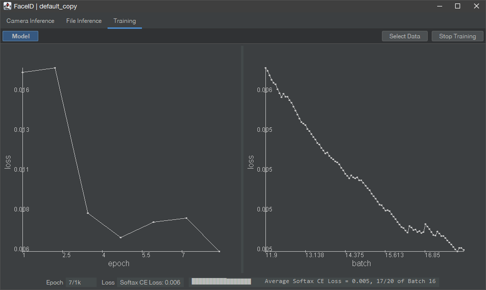
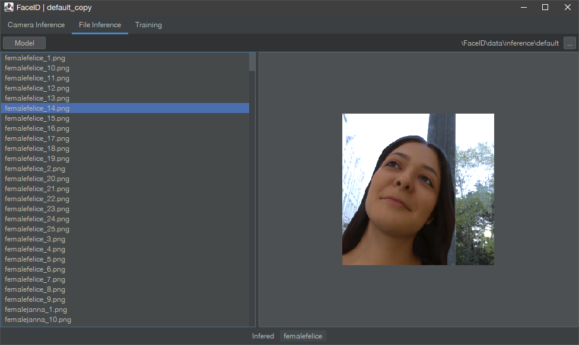
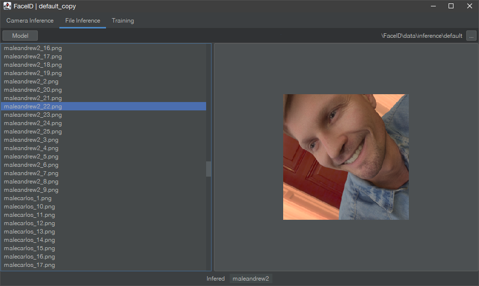
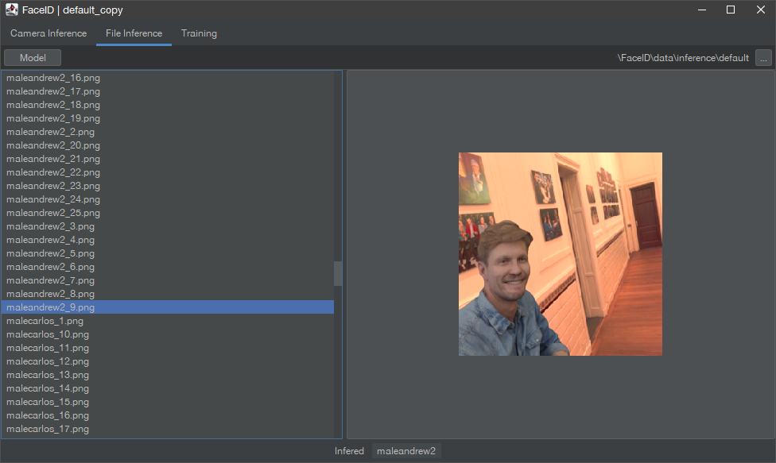

# Face ID
A basic face recognition program driven by [Hy](https://github.com/Brannigan123/Hy) a simple neural-net library.

Structure of training data folder :
- root
	- individual 1
		- image 1
		- image 2
	- individual 2
		- image 1
		- image 2

## Screenshots

### Training panel

### Inference panel
